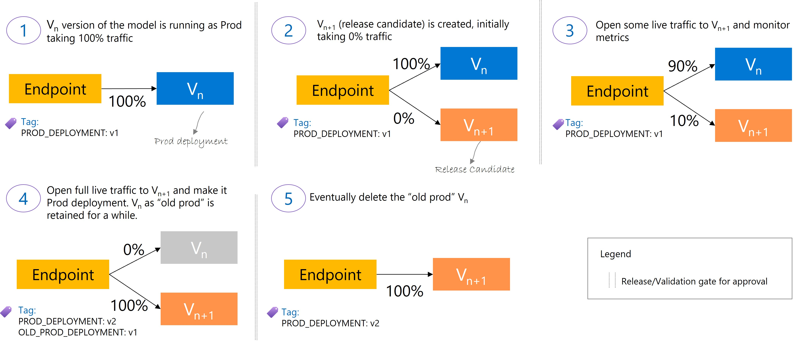

# Safe rollout of ML models using Azure ML Managed Online Endpoints

## User story
*"As an ML engineer, I want to use __devops pipelines__ to __safely rollout new version of a model__ in production __with validation gates__ inorder to __maintain production SLA__ and efficiently manage the rollout process"*

This repo shows how you can automate the rollout of a new version of a model into production without distruption. It also shows how you can do __auto safe rollout__ by automatically validating if metrics are within threshiold in the release/validation gates.

## Refresher on Endpoints concept
After you train a machine learning model, you need to deploy the model so that others can use it to perform inferencing. In Azure Machine Learning, you can use endpoints and deployments to do so.

An __endpoint__ is an HTTPS endpoint that clients can call to receive the inferencing (scoring) output of a trained model. It provides:

* Authentication using key & token based auth
* SSL termination
* Traffic allocation between deployments
* A stable scoring URI (`endpoint-name.region.inference.ml.azure.com`)

A **deployment** is a set of compute resources hosting the model that performs the actual inferencing. It contains:

* Model details (code, model, environment)
* Compute resource and scale settings
* Advanced settings (like request and probe settings)

You can learn more about this [here](https://docs.microsoft.com/en-us/azure/machine-learning/concept-endpoints)

## Safe rollout concept

The below illustration shows how users can gradually upgrade to a new version of the model in a new deployment Vn+1 from the currently running version in deployment Vn. At every step it is a good practice to validate that operational metrics are all within threshold (e.g. response time tail latencies , #errors etc) before opening up more traffic. We have implemented this in this repo.

## Design of safe rollout pipeline
In the example here you will see the flow from training -> model registration -> safe rollout of new model version into production. You will see how we use [validate metrics](https://github.com/rsethur/validate-metrics) github action to automate the validation of operational metrics at very step of the rollout.

## Annotated output of auto safe rollout pipeline
This is how the output of the auto safe rollout run in this repo looks like. Every validation gate has a 5 min wait timer (configurable). As part of the protection rules you can also enable human approval.

## Safe rollout semantics

It is important to have clean set of semantics so that users share same vocabulary while implementing non trivial ci/cd pipelines. We use tags to keep track of the deployment types.

Deployment can be of three types:
* `PROD_DEPLOYMENT`: As the name suggests, the main model version serving prod traffic
* `OLD_PROD`: You might want to keep the last known good model for a while before deleting it.
* Release candidate: The new version of the model that you want to test before making it the production model. In the example in this repo since we have only one release candidate, we can get away without tagging this explicitly since we know the deployment name (we generate a unique name at the beginning of the ci/cd script). Good idea to tag this if you want to explicitly track this.

You can add additional tags to track for e.g. experimental models that you might have.

In the above diagram, the columns indicate the timeperiods (T0, T1 etc). The rows has the deployment versions. At T0 we have deployment Vn (version n) tagged as production and has 100% traffic. At T1 we have Vn+1 as release candidate taking 0% traffic. Gradually when it takes 100 % traffic it gets tagged as production and Vn becomes `OLD_PROD` and eventually gets deleted. We use the tags so that from the ci/cd scripts you will be able to identify the various types of deployment.

## Getting started
Just fork this repo and [follow instructions](docs/getting-started.md) to get started.

## References
1. [Validate metrics](https://github.com/rsethur/validate-metrics) github action
1. [German Creditcard Dataset](https://www.kaggle.com/uciml/german-credit)from UCI/kaggle
 `Dua, D. and Graff, C. (2019). UCI Machine Learning Repository [http://archive.ics.uci.edu/ml]. Irvine, CA: University of California, School of Information and Computer Science.`