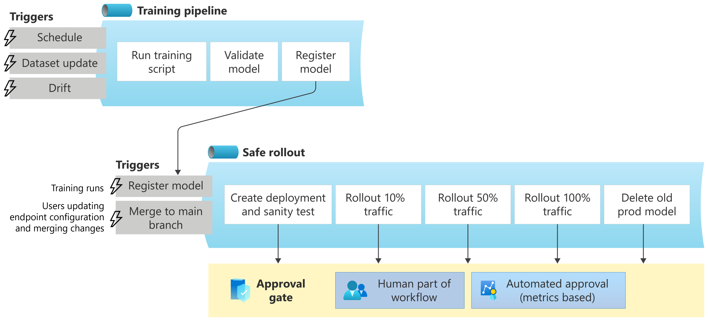

# Safe rollout of ML models using Azure ML Managed Online Endpoints

## User story
*"As an ML engineer, I want to use __devops pipelines__ to __safely rollout new version of a model__ in production __with validation gates__ inorder to __maintain production SLA__ and efficiently manage the rollout process"*

This repo shows how you can automate the rollout of a new version of a model into production without distruption.

## Semantics of safe rollout

The below illustration shows how users can gradually upgrade to version n+1 of the model from the currently running version n. At every step it is a good practice to validate that operational metrics are all within threshold (e.g. response time tail latencies , #errors etc). 

## Design of safe rollout pipeline
In the example here you will see the flow from training -> model registration -> safe rollout of new model version into production. You will see how we use [validate metrics](https://github.com/rsethur/validate-metrics) github action to automate the validation of operational metrics at very step of the rollout.

## Annotated output of the safe rollout pipeline
This is how the output of the safe rollout run in this repo looks like. Every validation gate has a 5 min wait timer (configurable). As part of the protection rules you can also enable human approval.

## Getting started
Just fork this repo and [follow instructions](docs/getting-started.md) to get started.

## References
1. [Validate metrics](https://github.com/rsethur/validate-metrics) github action
1. [German Creditcard Dataset](https://www.kaggle.com/uciml/german-credit)from UCI/kaggle
 `Dua, D. and Graff, C. (2019). UCI Machine Learning Repository [http://archive.ics.uci.edu/ml]. Irvine, CA: University of California, School of Information and Computer Science.`